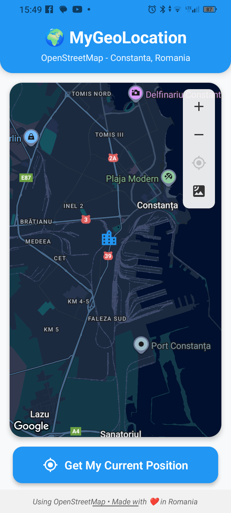
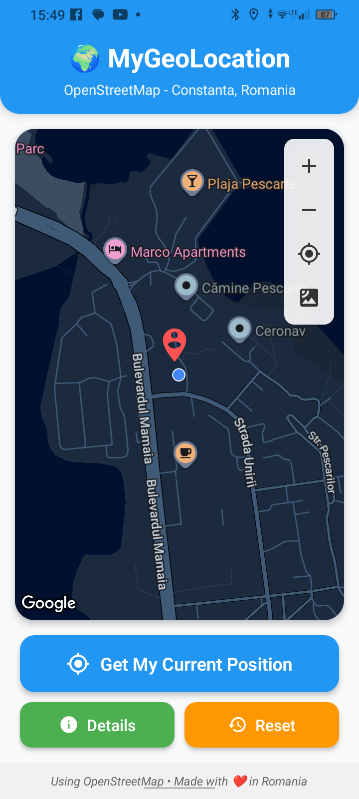
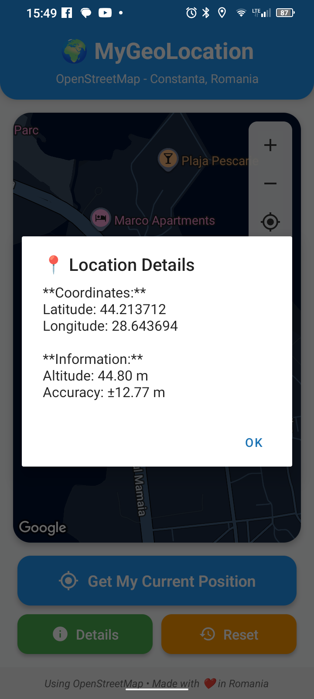

# MyGeoLocation
React Native Geolocation App

A modern React Native geolocation application built with Expo, featuring OpenStreetMap integration, real-time location tracking, and a sleek user interface.

1)Features

    🗺️ Interactive Maps: OpenStreetMap integration with terrain tiles

    📍 Real-time Geolocation: Get your current position with high accuracy

    🎯 Multiple Map Views: Switch between standard and satellite views

    📊 Location Details: View comprehensive location information

    🔧 Map Controls: Zoom in/out, re-center, and reset functionality

    📱 Cross-platform: Works on both iOS and Android

    🎨 Modern UI: Clean, intuitive interface with smooth animations
	
2)Screenshots

3)Installation

git clone https://github.com/GeoTuxMan/MyGeoLocation.git

cd MyGeoLocation

>npm install

>npm install -g expo-cli

>npx expo install expo-location react-native-maps @expo/vector-icons

4)Running the App
>npx expo start

5)Testing on Physical Device

    Install Expo Go from App Store (iOS) or Google Play (Android)

    Start the development server: npx expo start

    Scan the QR code with Expo Go app

    Allow location permissions when prompted
	
6)Building the App

>npm install -g eas-cli

>eas login

>as build:configure

# Build for Android
>eas build --platform android --profile production

# Build for iOS (macOS only)
>eas build --platform ios --profile production
